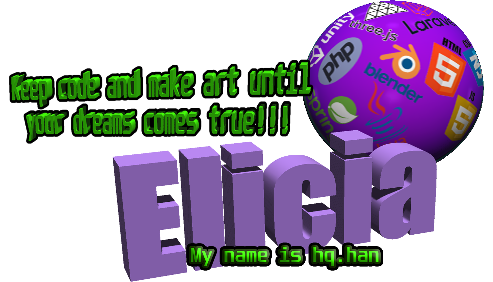

### ✨ I liked it, I was good at it, I was alive ✨

Saya suka logika dalam koding-mengkoding, tapi ketika masuk institusi pendidikan semuanya terkesan njujug sehingga harus banyak ngulik sendiri untuk mendapatkan ilmu. Sayang waktunya tidak terlalu cukup karena liburan pun diisi acara-acara aneh di kampus yang wajib mahasiswa ikuti, jadi hanya mengalir saja.

<!--
**Habbatul/Habbatul** is a ✨ _special_ ✨ repository because its `README.md` (this file) appears on your GitHub profile.

Here are some ideas to get you started:

- 🔭 I’m currently working on ...
- 🌱 I’m currently learning ...
- 👯 I’m looking to collaborate on ...
- 🤔 I’m looking for help with ...
- 💬 Ask me about ...
- 📫 How to reach me: ...
- 😄 Pronouns: ...
- ⚡ Fun fact: ...
-->

| |  |
| ------------- | ------------- |

- 🌱 I’m currently learning Assembly
- 🖥️ This is for document my artworks
- ⌨️ Coding is a great hobby
- 📖 Road to GameDev & SoftwareDev

  

<table><tr><td valign="top" width="33%">

### Frontend  

  
  
  
  
  

</td>

<td valign="top">
  
### Game Dev  

  
  
  
  
  

</td><td valign="top">

### Backend  

  
  
  
  

</td>
  
  <td align="top">

### Lainnya  

  
  
  
  
  
  
  

  
  </td></tr></table>  

   

