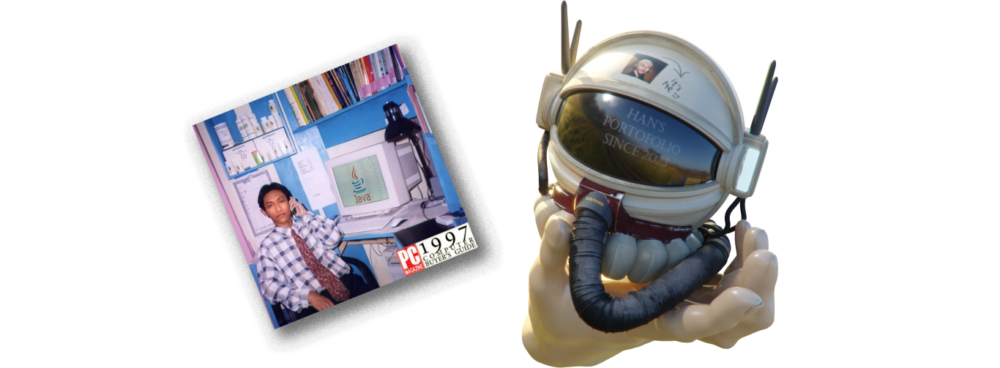
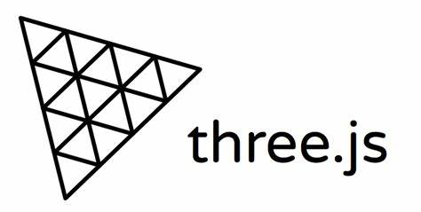

 

<b><h3><a href="https://hq.achmodez.tech/">Click here for my portofolio website!!!</a></h3></b>

 

<h1> <a href="https://hq.achmodez.tech/">About Me</a> </h1>

<b> My main focus in development is on the Spring Ecosystem and deployment with Docker & Nginx. </b>

 I work with technologies abstraction but try to study about low-level and diving into it's magic. I love about computer graphic, making games, and making CRUD App on website, desktop, or android.

  
| |  |
| ------------- | ------------- |

 

- 🌱 I’m currently learning Infra (Docker & Nginx) & Graphical Computer
- 🖥️ This is for document my artworks
- ⌨️ Coding is a great hobby
- 📖 Junior Software Engineer (backend Java, fullstack PHP, Indie Game Dev)

 

| Backend (pros)  | Deployment (pros)   | Fullstack (pros) |
|---|---|---------|
| 
     |   
   
      |   
   </a>   
 |

| Frontend (entushiast) |
|-----------|
|   
    <a href="https://en.wikipedia.org/wiki/HTML5" target="_blank">            </a>    
 |

| Game Dev (Hobby)   | Desktop (Hobby)   | Mobile (Hobby)   |
|-----------|-----------|-----------|
| 
     
      |     
    
     |     
         |

